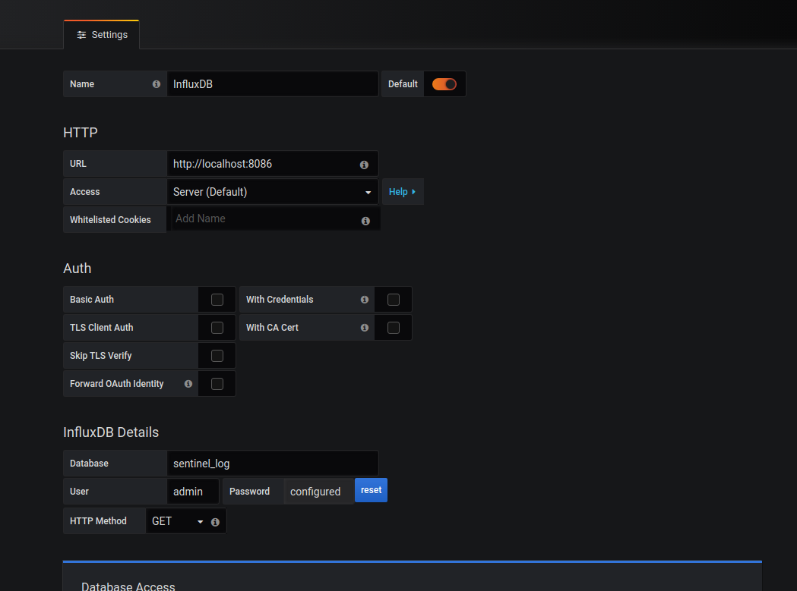
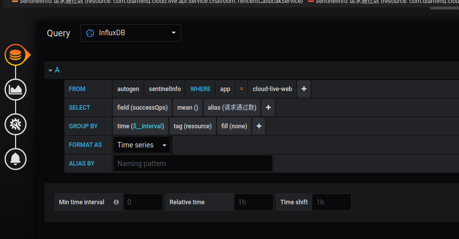

# 步骤

 * java -jar -Dspring.influx.url=http://localhost:8086 -Dspring.influx.user=admin -Dspring.influx.password=admin -Dspring.influx.password=admin sentinel-dashboard.jar
 
 * sentinel 集成influxdb
 * https://zhuanlan.zhihu.com/p/88176525
 
1. 安装
* 连接
influx
* 创建用户
CREATE USER admin with PASSWORD 'admin' WITH ALL PRIVILEGES
* 退出
exit
* 用户密码登录
influx -username admin -password admin
* 创建数据库
CREATE DATABASE sentinel_log

# grafana

## 数据源

## dashboard

 